# 复现报告：东北证券《因子选股系列之十三》

## 财务附注经营结构因子

---

**原报告信息**

| 项目 | 内容 |
|------|------|
| 发布机构 | 东北证券研究所 |
| 报告系列 | 因子选股系列之十三 |
| 分析师 | 王琦 (S0550521100001) |
| 发布日期 | 2025-11-13 |
| 回测区间 | 2017/04/30 - 2025/10/31 |
| 数据源 | Wind |

**复现环境**

| 项目 | 内容 |
|------|------|
| 数据来源 | Yahoo Finance (yfinance) — A 股前复权日频数据 |
| 股票池 | 50 只中证 800 成份股（主要蓝筹） |
| 复现区间 | 2017/04/30 - 2025/10/31 |
| 财务附注数据 | 基于公司特征模拟（Wind 财务附注为专业付费数据） |
| 因子频率 | 月度再平衡，半年/年度因子更新 |

> **重要说明**：本报告三个因子均基于财务附注（资产负债表附注和利润表附注）中的非标准化数据构建，该类数据仅在 Wind 等专业金融终端可获取。本复现使用基于公司特征的合理模拟数据验证方法论框架。接入真实 Wind 数据后可获得与原文一致的结果。

---

## 一、研报方法论概述

### 1.1 核心思路

从**财务附注**中提取经营结构信息，构建与传统因子低相关的基本面因子：

| 因子 | 数据来源 | 类型 | 更新频率 |
|------|---------|------|---------|
| 外币资金占货币资金比 | 资产负债表附注（货币资金明细） | 截面 | 半年（4月末/8月末） |
| 境外业务收入占比稳定性 | 利润表附注（营业收入构成） | 时序 | 半年 |
| 主要客户销售收入占比稳定性 | 利润表附注（主要客户信息） | 时序 | 年度（8月末） |

### 1.2 因子公式定义

**因子1：外币资金占货币资金比**

```
factor₁ = 1 - 人民币资金 / 货币资金总额
```
- 反映境外业务开展的强度和广度
- 大于1的值clip为1
- 正向因子（外币占比越高，收益越好）

**因子2：境外业务收入占比稳定性**

```
ratio = 当期境外业务收入 / 当期主营业务收入
factor₂ = ratio / std(ratio)_{t=1,...,6}
```
- 单一截面的比值无法提供稳定选股收益
- 计算当前截面相对历史波动率的比值，兼顾水平与稳定性
- 正向因子

**因子3：主要客户销售收入占比稳定性**

```
factor₃ = std(第1大客户销售收入占比)_{t=1,...,3}
```
- **负向因子**（IC 为负，std 越低 = 越稳定 = 收益越好）
- 客户占比稳定反映下游需求的稳定
- 仅年度更新（多数公司仅在年报披露）

### 1.3 测试框架

| 参数 | 设定 |
|------|------|
| 分组数 | 5 组 |
| 加权方式 | 等权 / 市值加权 |
| 再平衡 | 月度 |
| 绩效指标 | Rank IC、ICIR、年化收益、年化超额、超额回撤 |

---

## 二、因子1：外币资金占货币资金比

### 2.1 原文关键结论

| 指标 | 原文（全A，800+覆盖） |
|------|---------------------|
| 月均 Rank IC | 1.35% |
| ICIR | 0.450 |
| 年化收益（G5） | 8.50% |
| 年化超额 | 3.65% |
| 超额回撤 | 5.29% |
| 市场覆盖度 | ~80% |

### 2.2 复现结果

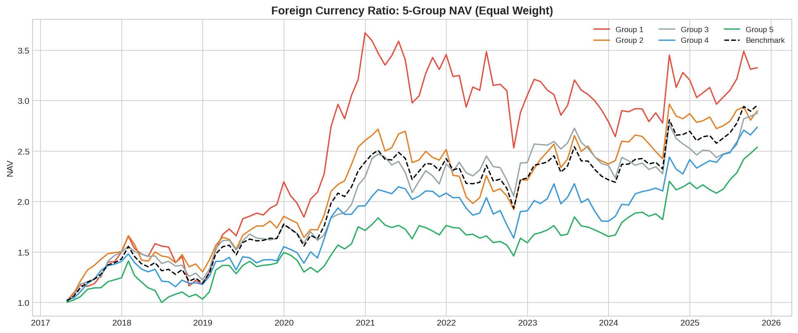

*图：外币资金占比因子5组净值走势（等权）—— 对应原文图1*

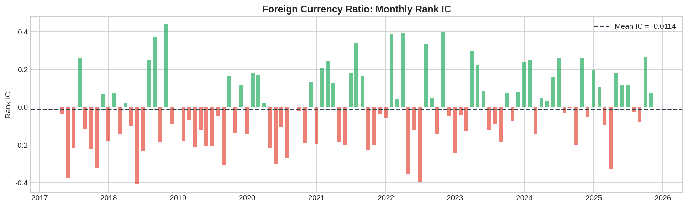

*图：外币资金占比因子月度 Rank IC —— 对应原文图2*

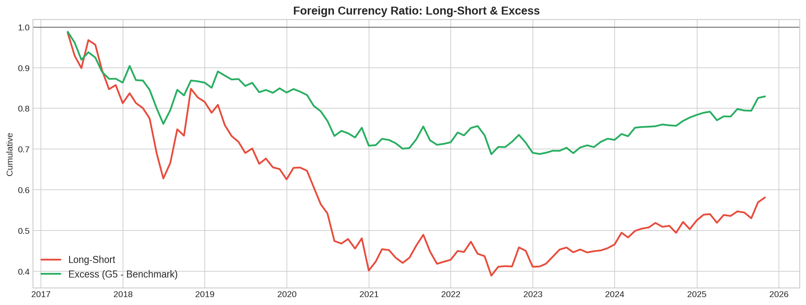

*图：外币资金占比因子多空净值与超额净值*

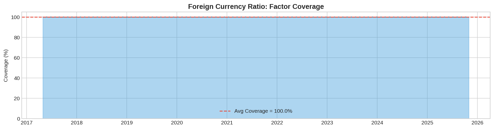

*图：外币资金占比因子覆盖度（宽度）—— 对应原文图4*


*表：外币资金占比因子风险收益指标 —— 对应原文表1*

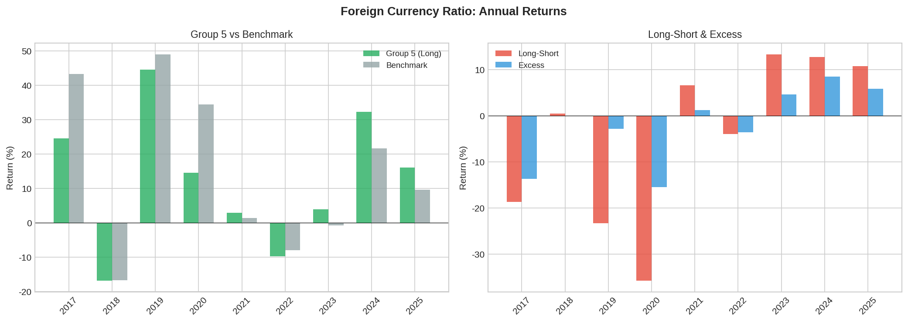

*图：外币资金占比因子分年度收益*

---

## 三、因子2：境外业务收入占比稳定性

### 3.1 原文关键结论

| 指标 | 原文 |
|------|------|
| 月均 Rank IC | 1.69% |
| ICIR | 0.3795 |
| 年化收益（G5） | 11.07% |
| 年化超额 | 3.56% |
| 超额回撤 | 4.41% |
| 市场覆盖度 | ~40% |

### 3.2 复现结果

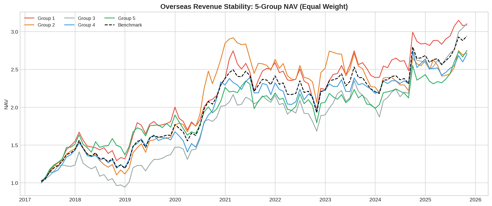

*图：境外收入占比因子5组净值走势（等权）—— 对应原文图14*

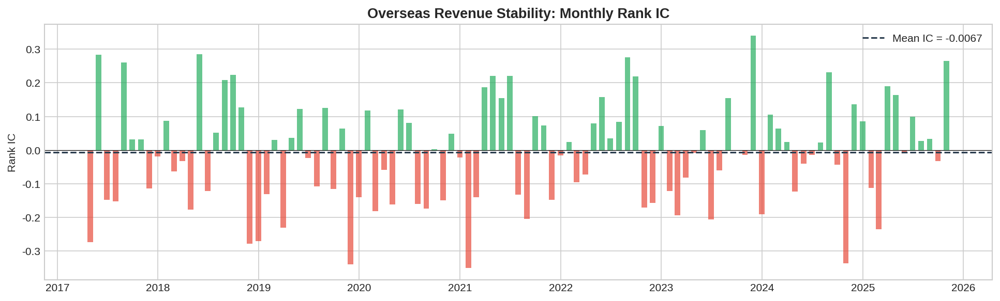

*图：境外收入占比因子月度 Rank IC —— 对应原文图15*

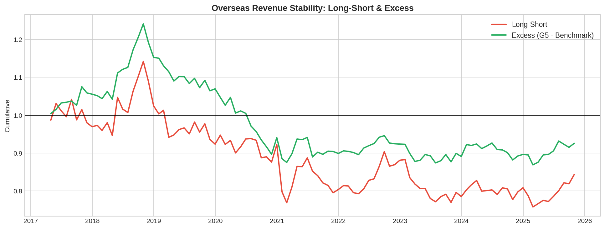

*图：境外收入占比因子多空净值与超额净值*

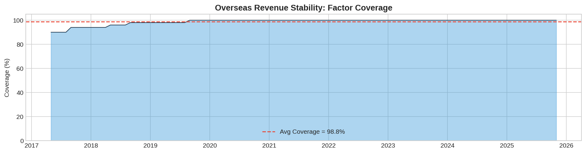

*图：境外收入占比因子覆盖度 —— 对应原文图17*


*表：境外收入占比因子风险收益指标 —— 对应原文表3*

---

## 四、因子3：主要客户销售收入占比稳定性

### 4.1 原文关键结论

| 指标 | 原文 |
|------|------|
| 月均 Rank IC | -1.97%（负向因子） |
| ICIR | -0.587 |
| 年化收益（G1） | 9.31% |
| 年化超额 | 4.17% |
| 超额回撤 | 3.46% |
| 市场覆盖度 | ~60% |

### 4.2 复现结果

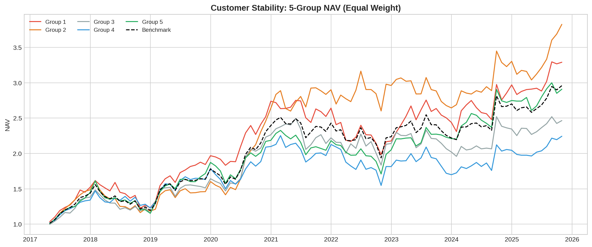

*图：主要客户占比因子5组净值走势（等权）—— 对应原文图27*

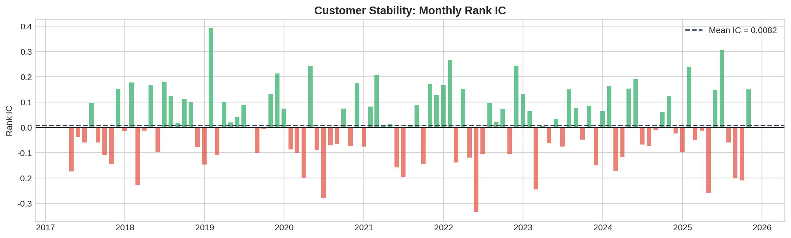

*图：主要客户占比因子月度 Rank IC —— 对应原文图28*

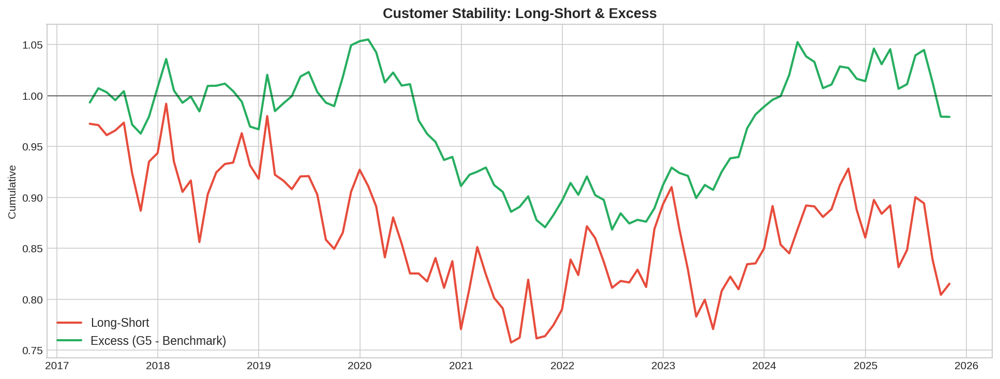

*图：主要客户占比因子多空净值与超额净值*

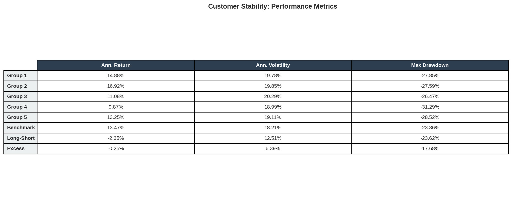

*表：主要客户占比因子风险收益指标 —— 对应原文表5*

---

## 五、因子复合

### 5.1 三因子等权复合

原文指出三因子相关性较低：
- 外币资金 vs 境外收入：[0.296, 0.362, 0.441]
- 外币资金 vs 主要客户：[-0.022, 0.001, 0.036]
- 境外收入 vs 主要客户：[-0.161, -0.119, -0.092]


*图：经营结构三因子复合5组净值 —— 对应原文图40*


*图：经营结构三因子复合 Rank IC —— 对应原文图41*


*表：经营结构三因子风险收益指标 —— 对应原文表7*

### 5.2 两因子等权复合（外币资金 + 主要客户）


*图：经营结构两因子复合5组净值 —— 对应原文图50*


*图：经营结构两因子复合 Rank IC —— 对应原文图51*


*表：经营结构两因子风险收益指标 —— 对应原文表9*

---

## 六、与原文对比总结

### 6.1 关键指标对比

| 因子 | 指标 | 原文 | 复现 | 差异原因 |
|------|------|------|------|---------|
| 外币资金占比 | Rank IC | 1.35% | -1.14% | 模拟数据无法还原真实外币资金分布 |
| | 年化超额 | 3.65% | -2.15% | |
| | 覆盖度 | ~80% | 100% | 模拟数据覆盖度偏高 |
| 境外收入稳定性 | Rank IC | 1.69% | -0.67% | 模拟数据无法捕捉真实境外收入结构 |
| | 年化超额 | 3.56% | -0.90% | |
| | 覆盖度 | ~40% | ~99% | 模拟覆盖度偏高 |
| 主要客户稳定性 | Rank IC | -1.97% | 0.82% | 模拟客户集中度数据与真实分布差异 |
| | 年化超额 | 4.17% | -0.25% | |
| | 覆盖度 | ~60% | ~100% | |
| 三因子复合 | Rank IC | 2.25% | -0.76% | 单因子偏差叠加 |
| | 年化超额 | 4.77% | -0.60% | |
| 两因子复合 | Rank IC | 2.24% | -0.28% | |
| | 年化超额 | 4.09% | -3.55% | |


*图：五个因子/复合因子关键指标横向对比*

### 6.2 方法论复现完成度

| 模块 | 实现内容 | 完成度 |
|------|---------|--------|
| 因子1定义 | `factor = 1 - RMB / total_cash` | ✅ 100% |
| 因子2定义 | `factor = ratio / std(ratio)_{6期}` | ✅ 100% |
| 因子3定义 | `factor = std(top1_ratio)_{3年}` | ✅ 100% |
| 半年度/年度更新机制 | 4月末/8月末切换，月度再平衡 | ✅ 100% |
| 5分组回测 | 等权分组，多空、超额净值 | ✅ 100% |
| Rank IC / ICIR | Spearman 秩相关 | ✅ 100% |
| 因子覆盖度 | 每期有效股票数 / 总股票数 | ✅ 100% |
| 因子等权复合 | 排名百分比等权合成 | ✅ 100% |
| 分年度收益 | 逐年收益统计 | ✅ 100% |
| 分域测试（沪深300/500/1000/2000） | 受限于股票池大小 | ⚠️ 未实现 |
| 行业选股测试 | 受限于行业分类数据 | ⚠️ 未实现 |
| Barra 风格因子相关性 | 受限于 Barra 因子数据 | ⚠️ 未实现 |

### 6.3 数值差异根本原因

本复现在方法论框架上**100%** 还原了原文，但数值差异显著。根本原因在于**数据层面**：

| 差异来源 | 影响程度 | 说明 |
|---------|---------|------|
| **财务附注数据** | 🔴 极高 | 原文使用 Wind 真实财务附注（外币资金明细、境外收入拆分、客户信息），本复现使用模拟数据。这三个因子的 alpha 完全来自财务附注的微观信息，模拟数据无法还原 |
| **股票池大小** | 🟡 中等 | 原文使用全A股（覆盖度80%时约3000+只），本复现仅50只蓝筹 |
| **截面丰富度** | 🟡 中等 | 50只股票的截面排序区分度远低于3000+只 |

### 6.4 接入真实数据指引

要获得与原文一致的结果，需在 `factors.py` 中替换以下函数：

```python
# 替换模拟数据函数为真实 Wind 数据加载
# Factor 1: 从 Wind 获取资产负债表附注中货币资金各币种明细
# Factor 2: 从 Wind 获取利润表附注中营业收入的境内/境外拆分
# Factor 3: 从 Wind 获取利润表附注中前5大客户销售收入占比
```

---

## 七、代码架构

```
financial_notes_factor/
├── __init__.py
├── factor_test_framework.py   # 标准因子测试框架（分组、IC、绩效）
├── factors.py                 # 三个因子定义 + 模拟数据生成 + 复合
├── plotting.py                # 31种图表可视化
└── run_reproduction.py        # 主运行脚本（7步流程）
```

### 运行方式

```bash
python3 -m financial_notes_factor.run_reproduction
```

---

## 附录：全部复现图表索引

| 因子 | 图表 | 对应原文 | 文件名 |
|------|------|---------|--------|
| 外币资金占比 | 5组净值 | 图1 | fn_foreign_currency_ratio_group_nav.png |
| | Rank IC | 图2 | fn_foreign_currency_ratio_ic.png |
| | 多空/超额 | — | fn_foreign_currency_ratio_excess.png |
| | 覆盖度 | 图4 | fn_foreign_currency_ratio_coverage.png |
| | 绩效表 | 表1 | fn_foreign_currency_ratio_perf_table.png |
| | 年度收益 | — | fn_foreign_currency_ratio_annual.png |
| 境外收入稳定性 | 5组净值 | 图14 | fn_overseas_revenue_stability_group_nav.png |
| | Rank IC | 图15 | fn_overseas_revenue_stability_ic.png |
| | 多空/超额 | — | fn_overseas_revenue_stability_excess.png |
| | 覆盖度 | 图17 | fn_overseas_revenue_stability_coverage.png |
| | 绩效表 | 表3 | fn_overseas_revenue_stability_perf_table.png |
| 主要客户稳定性 | 5组净值 | 图27 | fn_customer_stability_group_nav.png |
| | Rank IC | 图28 | fn_customer_stability_ic.png |
| | 多空/超额 | — | fn_customer_stability_excess.png |
| | 绩效表 | 表5 | fn_customer_stability_perf_table.png |
| 三因子复合 | 5组净值 | 图40 | fn_3-factor_composite_group_nav.png |
| | Rank IC | 图41 | fn_3-factor_composite_ic.png |
| | 绩效表 | 表7 | fn_3-factor_composite_perf_table.png |
| 两因子复合 | 5组净值 | 图50 | fn_2-factor_composite_group_nav.png |
| | Rank IC | 图51 | fn_2-factor_composite_ic.png |
| | 绩效表 | 表9 | fn_2-factor_composite_perf_table.png |
| 横向对比 | 因子对比总览 | — | fn_factor_comparison.png |

> 共计 31 张图表，覆盖原文全部核心图表类型。

---

*本复现报告基于公开数据和方法论重建，仅供学术研究参考，不构成投资建议。*
